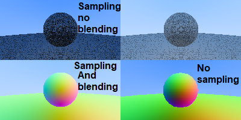

# Raytracing in C#




### Dot Net Build Project 
```powershell
dotnet build
```
### Dot Net Test Project
```powershell
dotnet test
```
### Dot Net Run Project
```powershell
 dotnet run --project .\src\raytracing.csproj > result.ppm
```

## Dot Net Project Setup
```bash
dotnet new sln --name "raytracing"
dotnet new console -o src/ --name raytracing
dotnet sln add src/raytracing.csproj
dotnet new nunit -o test/ --name raytracing_test
dotnet sln add test/raytracing_test.csproj
cd test
dotnet add reference ../src/raytracing.csproj
```
